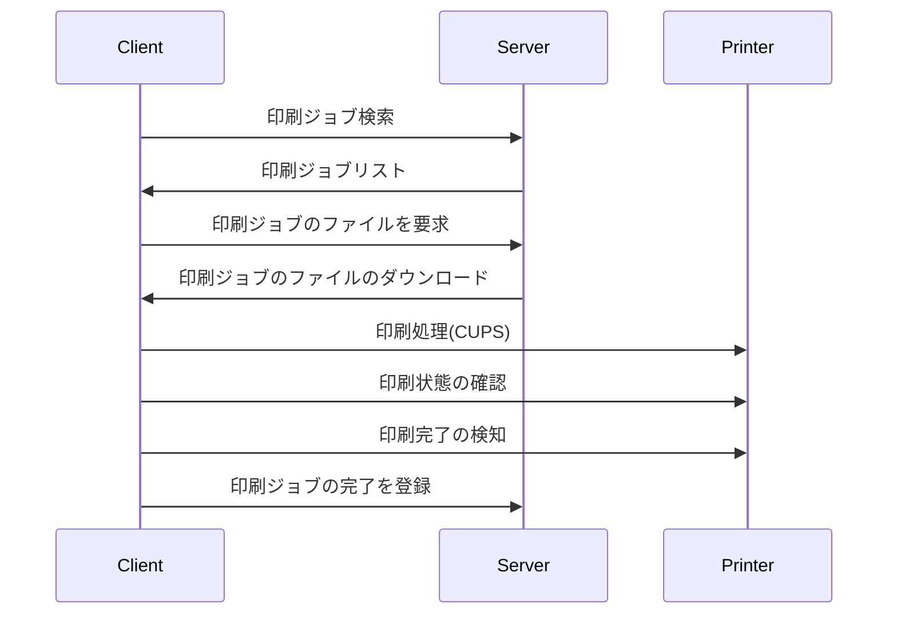

# About
to Printer, client.
印刷アプリケーションのクライアント(bash)スクリプトです

# 仕組み

```mermaid
sequenceDiagram
    participant Client
    participant Server
    participant Printer

    Client->>Server: 印刷ジョブ検索
    Server->>Client: 印刷ジョブリスト

    Client->>Server: 印刷ジョブのファイルを要求
    Server->>Client: 印刷ジョブのファイルのダウンロード

    Client->>Printer: 印刷処理(CUPS)
    Client->>Printer: 印刷状態の確認
    Client->>Printer: 印刷完了の検知

    Client->>Server: 印刷ジョブの完了を登録
```
